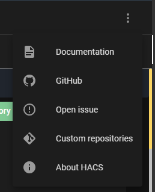
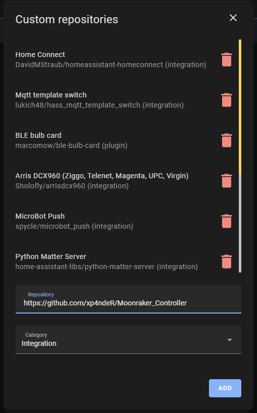

# Moonraker_Controller
Moonraker Controller
 Yo !

## Installation

Installed through [HACS](https://hacs.xyz/).

`Start HACS -> Integrations -> Overflow menu -> Custom repositories`

Add `https://github.com/xp4ndeR/Moonraker_Controller` as repository in `Custom Repository` field.
Select `Integration` as `Category`.

`Moonraker Controller` is now displayed in HACS integrations. Select it and press `Download this repository with HACS`.

Restart Home Assistant.

## Configuration

Add integration in Home Assistant.
